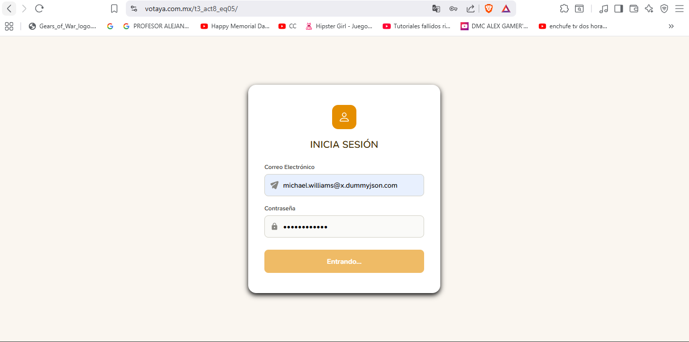
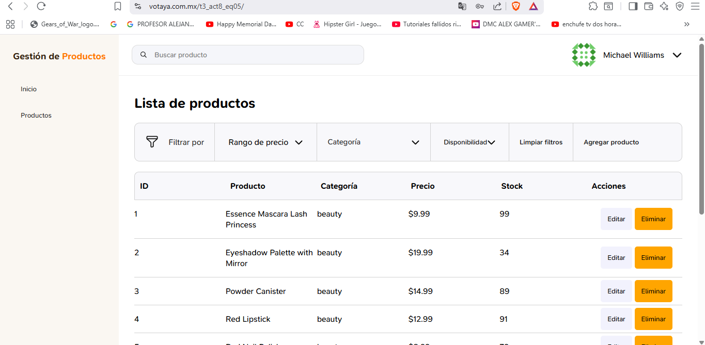
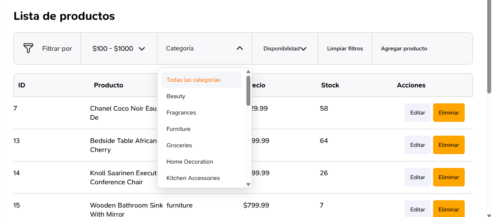
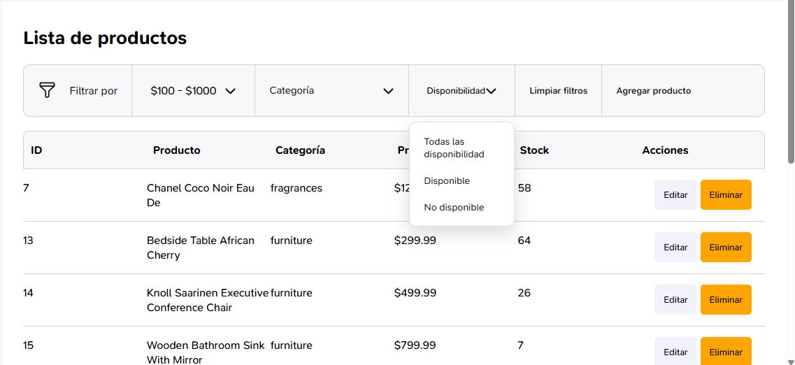
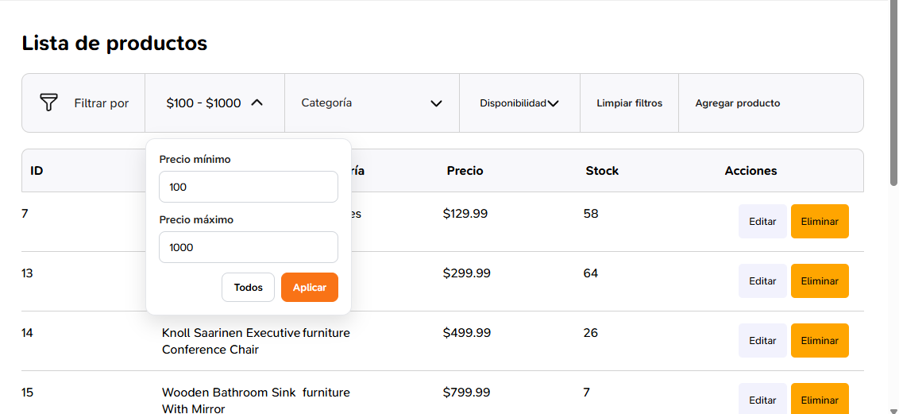
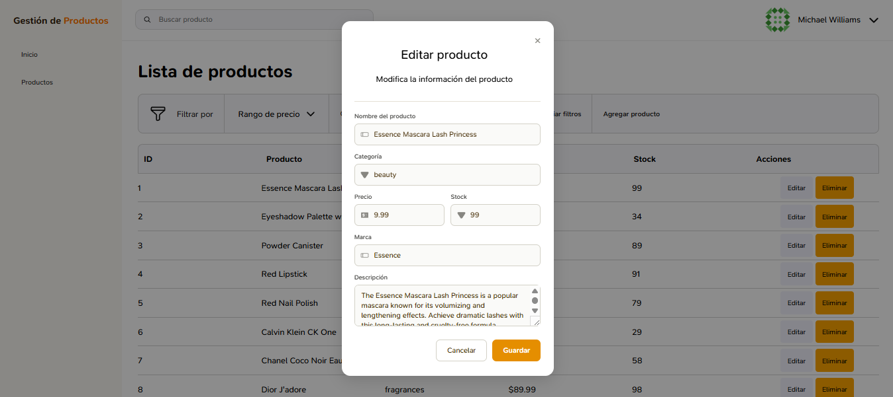
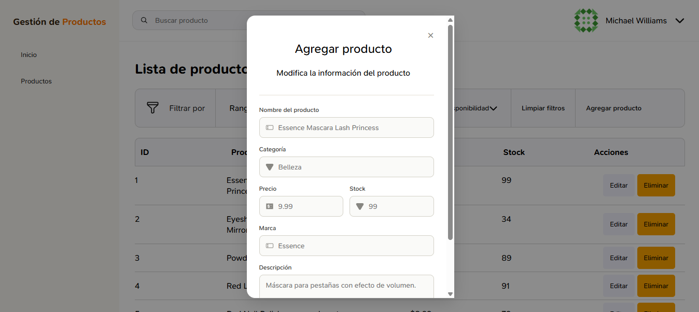

<div align="center">

# Instituto Tecnológico Nacional de México

### Instituto Tecnológico de Oaxaca

**Carrera:** Ingeniería en Sistemas Computacionales <br><br>
**Materia:** Programación Web<br><br>
**Actividad:** Actividad 8 — Consumo de APIs (React) <br><br>
**Docente:** Adelina Martínez Nieto<br><br>
**Integrantes:**
Gomez Roblero Angel Jahir <br>
Enríquez Rodríguez Alejandro Guillermo<br><br>
**Fecha de entrega:** 14 de julio del 2026<br><br>

</div>

# Sistema de Gestión de Productos — Actividad 8

## Descripción del proyecto

Mini sistema construido con **React + Vite**, que simula un login real consumiendo la API de **DummyJSON**, y muestra una tabla de datos interactiva con filtros, paginación y acciones CRUD, consumiendo una API de terceros.

Este proyecto está basado en el mockup de Figma realizado en la Actividad 7.

El proyecto se dividió en dos partes de trabajo:

| Integrante | Parte del proyecto |
|---|---|
| Alejandro Guillermo Enríquez Rodríguez | Fase 1 — Login (formulario, validaciones, consumo de `auth/login`), formulario/modal de "Editar Producto" |
| Angel Jahir Gomez Roblero | Fase 2 — Sidebar y Navbar (datos de usuario, cierre de sesión), Fase 3 — Tabla de datos (filtros, paginación, CRUD) |

## API utilizada para la tabla de datos

DummyJSON Productos (`https://dummyjson.com/products`)

## Documentación técnica

### Flujo del login hacia el sistema

1. El usuario ingresa su **correo electrónico** y **contraseña** en el formulario de login.
2. Se valida en el front-end que ambos campos no estén vacíos y que el correo tenga formato válido antes de enviar la petición.
3. Se busca el usuario correspondiente a ese correo en `https://dummyjson.com/users/search`, y se obtiene su `username` real.
4. Se envía la petición `POST` a `https://dummyjson.com/auth/login` con el `username` encontrado y la contraseña ingresada.
5. Si las credenciales son correctas, los datos del usuario (incluyendo su imagen) se guardan en el estado de la aplicación (`useState`) y se muestra el sistema (Sidebar + Navbar + Tabla).
6. Si son incorrectas, se muestra un mensaje de error claro sin salir del login.
7. Mientras no haya un usuario válido en el estado, el sistema no permite ver el resto de la aplicación (vista protegida).

### Cómo se pasa el usuario del login al resto del sistema

A diferencia de una versión con `sessionStorage`, este proyecto maneja la sesión completamente en memoria usando el estado de React (`useState` en `App.jsx`):

- Al iniciar sesión correctamente, `Login.jsx` llama a la función `onLoginExitoso(usuario)`, la cual recibe `App.jsx` y guarda el objeto completo del usuario (nombre, imagen, etc.) en el estado `persona`.
- Mientras `persona` sea `null`, la aplicación solo renderiza el componente `Login`.
- Una vez que `persona` tiene datos, se renderiza el layout completo del sistema (`Sidebar`, `Navbar`, tabla de datos), pasando `persona` como prop al `Navbar` para mostrar la foto y el nombre.
- Al cerrar sesión, `persona` se reinicia a `null`, regresando automáticamente a la pantalla de login.

### Métodos principales

| Método | Ubicación | Función |
|---|---|---|
| `loginUser(email, password)` | `src/services/api.js` | Busca el usuario por correo y realiza el login real contra DummyJSON |
| `validacionCampos()` | `src/components/Login.jsx` | Valida que los campos no estén vacíos y que el correo tenga formato válido |
| `enviar(e)` | `src/components/Login.jsx` | Controla el envío del formulario, muestra estado de carga y maneja errores |
| `alIniciarSesion(datosUsuario)` | `src/App.jsx` | Guarda al usuario en el estado global de la app tras un login exitoso |
| `cerrarSesion()` | `src/App.jsx` | Limpia el estado del usuario y regresa a la pantalla de login |


---

## Estructura del proyecto

```
t3_act8_eq05/
├── index.html
├── package.json
├── vite.config.js
├── .gitignore
├── README.md
├── public/
└── src/
    ├── main.jsx
    ├── App.jsx
    ├── App.css
    ├── index.css
    ├── components/
    │   ├── Login.jsx
    │   ├── Login.css
    │   ├── EditarProductoModal.jsx
    │   ├── EditarProductoModal.css
    │   ├── Navbar.jsx
    │   ├── Navbar.css
    │   ├── Sidebar.jsx
    │   ├── Sidebar.css
    │   └── [Tabla.jsx, Filtros.jsx, etc. de tu compañero]
    ├── services/
    │   └── api.js
    └── assets/
        └── icons/
```

---

## Proceso de creación

### 1. Mockup en Figma (Actividad 7)
Se diseñaron las 3 pantallas (login, sistema principal, formulario de edición) definiendo la paleta de colores, tipografía e íconos antes de programar.

### 2. Login (Login.jsx, Login.css)
- Se construyó el formulario con campos de correo y contraseña, siguiendo el estilo visual del mockup.
- Se implementó validación de campos vacíos y de formato de correo antes de llamar a la API.
- Se conectó con la API real de DummyJSON, mostrando estado de carga y mensajes de error claros.

### 3. Conexión login → estado global
- Se implementó el manejo de sesión mediante `useState` en `App.jsx`, protegiendo la vista del sistema mientras no haya un usuario autenticado.

### 4. Formulario de Editar Producto
- Se construyó el modal reutilizable `EditarProductoModal.jsx`, con los campos definidos en el mockup (nombre, categoría, precio, stock, marca, descripción).

### 5. [CAPTURAS]









---

## Tecnologías utilizadas

- **React** — construcción de la interfaz por componentes
- **Vite** — entorno de desarrollo y build de producción
- **CSS3** — estilos personalizados (sin framework)
- **DummyJSON** — API de autenticación y de datos
- **Git / GitHub** — control de versiones en equipo

---

## Ver en vivo

🔗 **Proyecto desplegado:** https://www.votaya.com.mx/t3_act8_eq05/

🔗 **Repositorio:** https://github.com/JahirRoblero/t3_act8_eq05


---

## Autores

**Alejandro Guillermo Enríquez Rodríguez** — Login, validaciones, consumo de API de autenticación, formulario de Editar Producto
**Angel Jahir Gomez Roblero** — Sidebar, Navbar, tabla de datos con filtros, paginación y CRUD

Estudiantes de Ingeniería en Sistemas Computacionales — Instituto Tecnológico de Oaxaca