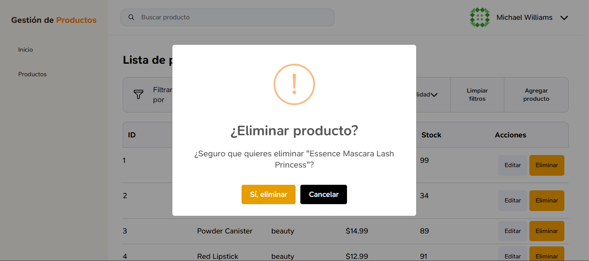

<div align="center">

# Instituto Tecnológico Nacional de México

### Instituto Tecnológico de Oaxaca

**Carrera:** Ingeniería en Sistemas Computacionales <br><br>
**Materia:** Programación Web<br><br>
**Actividad:** Actividad 8 — Consumo de APIs (React) <br><br>
**Docente:** Adelina Martínez Nieto<br><br>
**Integrantes:**
Gomez Roblero Angel Jahir <br>
Enríquez Rodríguez Alejandro Guillermo<br><br>
**Fecha de entrega:** 14 de julio del 2026<br><br>

</div>

# Sistema de Gestión de Productos — Actividad 8

## Descripción del proyecto

Mini sistema construido con **React + Vite**, que simula un login real consumiendo la API de **DummyJSON**, y muestra una tabla de datos interactiva con filtros, paginación y acciones CRUD, consumiendo una API de terceros.

Este proyecto está basado en el mockup de Figma realizado en la Actividad 7.

El proyecto se dividió en dos partes de trabajo:

| Integrante | Parte del proyecto |
|---|---|
| Alejandro Guillermo Enríquez Rodríguez | Fase 1 — Login (formulario, validaciones, consumo de `auth/login`), formulario/modal de "Editar Producto" |
| Angel Jahir Gomez Roblero | Fase 2 — Sidebar y Navbar (datos de usuario, cierre de sesión), Fase 3 — Tabla de datos (filtros, paginación, CRUD) |

## API utilizada para la tabla de datos

DummyJSON Productos (`https://dummyjson.com/products`)

## Documentación técnica

### Flujo del login hacia el sistema

1. El usuario ingresa su **correo electrónico** y **contraseña** en el formulario de login.
2. Se valida en el front-end que ambos campos no estén vacíos y que el correo tenga formato válido antes de enviar la petición.
3. Se busca el usuario correspondiente a ese correo en `https://dummyjson.com/users/search`, y se obtiene su `username` real.
4. Se envía la petición `POST` a `https://dummyjson.com/auth/login` con el `username` encontrado y la contraseña ingresada.
5. Si las credenciales son correctas, los datos del usuario (incluyendo su imagen) se guardan en el estado de la aplicación (`useState`) y se muestra el sistema (Sidebar + Navbar + Tabla).
6. Si son incorrectas, se muestra un mensaje de error claro sin salir del login.
7. Mientras no haya un usuario válido en el estado, el sistema no permite ver el resto de la aplicación (vista protegida).

### Cómo se pasa el usuario del login al resto del sistema

Este proyecto maneja la sesión completamente en memoria usando el estado de React (`useState` en `App.jsx`):

- Al iniciar sesión correctamente, `Login.jsx` llama a la función `onLoginExitoso(usuario)`, la cual recibe `App.jsx` y guarda el objeto completo del usuario (nombre, imagen, etc.) en el estado `persona`.
- Mientras `persona` sea `null`, la aplicación solo renderiza el componente `Login`.
- Una vez que `persona` tiene datos, se renderiza el layout completo del sistema (`Sidebar`, `Navbar`, tabla de datos), pasando el nombre completo y la imagen de perfil al `Navbar`.
- Al cerrar sesión, `persona` se reinicia a `null` (además de limpiar el sidebar y cualquier modal abierto), regresando automáticamente a la pantalla de login.

### Métodos principales

**Login y sesión**

| Método | Ubicación | Función |
|---|---|---|
| `loginUser(email, password)` | `src/services/api.js` | Busca el usuario por correo y realiza el login real contra DummyJSON |
| `validacionCampos()` | `src/components/Login.jsx` | Valida que los campos no estén vacíos y que el correo tenga formato válido |
| `enviar(e)` | `src/components/Login.jsx` | Controla el envío del formulario, muestra estado de carga y maneja errores |
| `alIniciarSesion(datosUsuario)` | `src/App.jsx` | Guarda al usuario en el estado global de la app tras un login exitoso |
| `cerrarSesion()` | `src/App.jsx` | Limpia el estado del usuario, cierra sidebar y modales, y regresa a la pantalla de login |

**Sidebar y Navbar**

| Método | Ubicación | Función |
|---|---|---|
| `abrirSidebar()` / `cerrarSidebar()` | `src/App.jsx` | Controlan la visibilidad del menú lateral |
| `cambiarEstadoMenu()` | `src/components/Navbar.jsx` | Abre/cierra el menú desplegable del usuario (foto, nombre y botón de cerrar sesión) |

**Tabla de datos, filtros y paginación**

| Método | Ubicación | Función |
|---|---|---|
| `obtenerProductos()` | `src/services/api.js` | Realiza la petición `GET` a `https://dummyjson.com/products` |
| `obtenerCategorias()` | `src/services/api.js` | Obtiene la lista de categorías disponibles para el filtro |
| `cargarProductos()` (dentro de `useEffect`) | `src/App.jsx` | Carga los productos al montar el componente, controlando estados de carga y error |
| `productosFiltrados` | `src/App.jsx` | Aplica en conjunto los filtros de categoría, disponibilidad y rango de precio sobre la lista de productos |
| `productosPaginados` / `totalPaginas` | `src/App.jsx` | Calculan la porción de productos a mostrar según la página actual (10 registros por página) |
| `cambiarPagina(nuevaPagina)` | `src/App.jsx` | Cambia la página actual validando que esté dentro del rango permitido |
| `generarIndicesPaginacion()` | `src/App.jsx` | Genera los números de página a mostrar en los controles, con "..." cuando hay muchas páginas |
| `seleccionarCategoria()` / `mostrarTodasLasCategorias()` | `src/components/BarraDeFiltros.jsx` | Controlan el filtro por categoría (dropdown poblado dinámicamente desde la API) |
| `seleccionarDisponibilidad()` / `mostrarTodasLasDisponibilidades()` | `src/components/BarraDeFiltros.jsx` | Controlan el filtro por disponibilidad (según el stock del producto) |
| `aplicarRangoPrecio()` / `mostrarTodosLosPrecios()` | `src/components/BarraDeFiltros.jsx` | Validan y aplican el filtro por rango de precio mínimo/máximo |
| `limpiarFiltros()` | `src/components/BarraDeFiltros.jsx` | Reinicia todos los filtros (categoría, disponibilidad, precio) a su estado inicial |

**Acciones CRUD**

| Método | Ubicación | Función |
|---|---|---|
| `abrirModalAgregar()` / `cerrarModalAgregar()` | `src/App.jsx` | Controlan la visibilidad del modal de "Agregar producto" |
| `agregarProducto(nuevoProducto)` | `src/App.jsx` | Agrega el nuevo producto al estado local, asignándole un `id` autoincremental |
| `abrirModalEditar(producto)` / `cerrarModalEditar()` | `src/App.jsx` | Controlan la visibilidad del modal de edición y qué producto se está editando |
| `guardarProductoEditado(datosActualizados)` | `src/App.jsx` | Actualiza el producto correspondiente dentro del estado local de productos |
| `eliminarProducto(idProducto)` | `src/App.jsx` | Muestra una confirmación con **SweetAlert2** antes de eliminar, y remueve el producto del estado local |
| `manejarGuardar(e)` | `EditarProductoModal.jsx` / `AgregarProductoModal.jsx` | Recolecta los datos del formulario y los envía al componente padre mediante la prop `clickGuardar` |

---

## Estructura del proyecto

```
t3_act8_eq05/
├── index.html
├── package.json
├── vite.config.js
├── .gitignore
├── README.md
├── public/
└── src/
    ├── main.jsx
    ├── App.jsx
    ├── App.css
    ├── index.css
    ├── components/
    │   ├── Login.jsx
    │   ├── Login.css
    │   ├── Navbar.jsx
    │   ├── Navbar.css
    │   ├── Sidebar.jsx
    │   ├── Sidebar.css
    │   ├── BarraDeFiltros.jsx
    │   ├── BarraDeFiltros.css
    │   ├── TablaProductos.jsx
    │   ├── TablaProductos.css
    │   ├── EditarProductoModal.jsx
    │   ├── EditarProductoModal.css
    │   └── AgregarProductoModal.jsx      (reutiliza EditarProductoModal.css)
    ├── services/
    │   └── api.js                        (loginUser, obtenerProductos, obtenerCategorias)
    └── assets/
        ├── icons/
        ├── images/
        └── screenshots/
```

---

## Proceso de creación

### 1. Mockup en Figma (Actividad 7)
Se diseñaron las 3 pantallas (login, sistema principal, formulario de edición) definiendo la paleta de colores, tipografía e íconos antes de programar.

### 2. Login (Login.jsx, Login.css)
- Se construyó el formulario con campos de correo y contraseña, siguiendo el estilo visual del mockup.
- Se implementó validación de campos vacíos y de formato de correo antes de llamar a la API.
- Se conectó con la API real de DummyJSON, mostrando estado de carga y mensajes de error claros.

### 3. Conexión login → estado global
Se implementó el manejo de sesión mediante `useState` en `App.jsx`, protegiendo la vista del sistema mientras no haya un usuario autenticado.

### 4. Formulario de Editar y Agregar Producto
- Se construyó el modal `EditarProductoModal.jsx`, con los campos definidos en el mockup (nombre, categoría, precio, stock, marca, descripción), precargando los datos del producto seleccionado mediante `useEffect`.
- Se reutilizó la misma estructura visual para crear `AgregarProductoModal.jsx`, compartiendo el archivo de estilos `EditarProductoModal.css` para mantener consistencia entre ambos formularios.

### 5. Sidebar y Navbar (Fase 2)
- Se construyó `Sidebar.jsx` con las opciones de navegación "Inicio" y "Productos".
- Se construyó `Navbar.jsx`, mostrando la foto de perfil y el nombre completo del usuario autenticado, con un menú desplegable que incluye el botón "Cerrar sesión".
- La vista del sistema completo queda protegida en `App.jsx`: mientras no exista un usuario en el estado, solo se renderiza el componente `Login`.

### 6. Tabla de datos, filtros y paginación (Fase 3)
- Se consumió la API `https://dummyjson.com/products` para obtener el listado de productos.
- Se construyó `TablaProductos.jsx` como componente reutilizable para renderizar cada fila.
- Se implementó `BarraDeFiltros.jsx` con tres filtros combinables: categoría (obtenida dinámicamente de la API), disponibilidad (según el stock) y rango de precio (mínimo/máximo con validación).
- Se implementó paginación local de 10 productos por página, con controles numerados y flechas de anterior/siguiente.

### 7. Acciones CRUD
- **Agregar:** modal `AgregarProductoModal.jsx` que añade el producto al estado local con un `id` autoincremental.
- **Editar:** modal `EditarProductoModal.jsx` que precarga los datos del producto seleccionado y actualiza el estado local al guardar.
- **Eliminar:** confirmación mediante **SweetAlert2** antes de remover el producto del estado local, con mensaje de éxito posterior.

### 8. Capturas de pantalla



---

## Tecnologías utilizadas

- **React** — construcción de la interfaz por componentes
- **Vite** — entorno de desarrollo y build de producción
- **CSS3** — estilos personalizados (sin framework)
- **DummyJSON** — API de autenticación y de datos de productos
- **SweetAlert2** — confirmaciones y mensajes de éxito/error en acciones CRUD
- **Git / GitHub** — control de versiones en equipo

---

## Ver en vivo

🔗 **Proyecto desplegado:** https://www.votaya.com.mx/t3_act8_eq05/

🔗 **Repositorio:** https://github.com/JahirRoblero/t3_act8_eq05

---

## Autores

**Alejandro Guillermo Enríquez Rodríguez** — Login, validaciones, consumo de API de autenticación, formulario de Editar Producto
**Angel Jahir Gomez Roblero** — Sidebar, Navbar, tabla de datos con filtros, paginación y acciones CRUD

Estudiantes de Ingeniería en Sistemas Computacionales — Instituto Tecnológico de Oaxaca